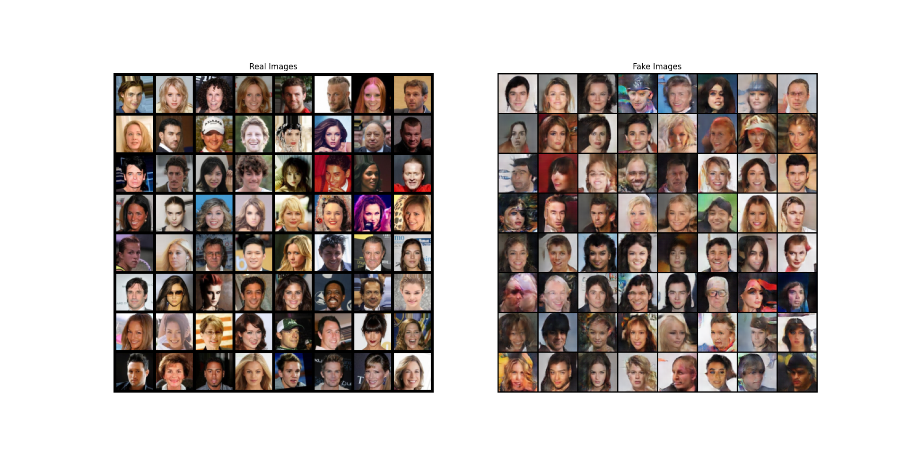

# DCGAN for People Faces Generation
This is an implementation of a Deep Convolutional Generative Adversarial Network (DCGAN) to generate images of people faces. The model is trained on a dataset of human faces and learns to generate new faces that are similar to the ones in the dataset, can be extended to generate any image.

## Dataset
The dataset used for this implementation is the CelebA dataset, which contains over 200,000 celebrity faces with annotations such as facial landmarks and attributes. The dataset can be downloaded in the following link.
(http://mmlab.ie.cuhk.edu.hk/projects/CelebA.html)

## Model Architecture
The generator and discriminator architectures are based on the DCGAN paper by Radford et al. The generator takes a random noise vector as input and generates an image of size 64x64x3 (width x height x channels). The discriminator takes an image as input and outputs a scalar value indicating whether the image is real or fake.

Paper: https://arxiv.org/abs/1511.06434

## Generator Architecture
The generator architecture consists of several layers of transposed convolutions, batch normalization, and ReLU activation functions. The output layer uses a tanh activation function to ensure that the pixel values are in the range [-1, 1].

# Discriminator Architecture
The discriminator architecture consists of several layers of convolutions, batch normalization, and LeakyReLU activation functions. The output layer uses a sigmoid activation function to ensure that the output is in the range [0, 1].

## Training

The model is trained using the Adam optimizer with a learning rate of 0.0002 and a batch size of 128. The generator and discriminator are trained alternately for a total of 10 epochs.

## Results

After training, the generator is capable of generating new images of people faces that are similar to the ones in the dataset. Examples:

## Usage

To use this implementation, you need to have PyTorch and the CelebA dataset downloaded. You can train the model by running the `model.py` script:

## Conclusion

This implementation shows that DCGANs can be used to generate high-quality images of people faces. With further improvements in model architecture and training techniques, it is possible to generate even more realistic images.